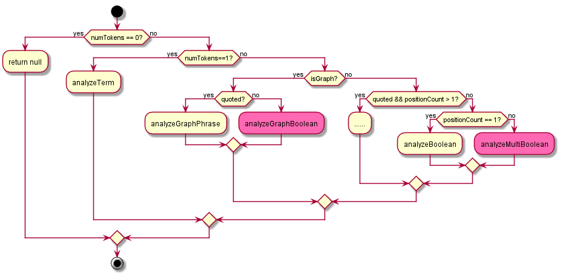
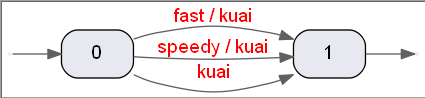
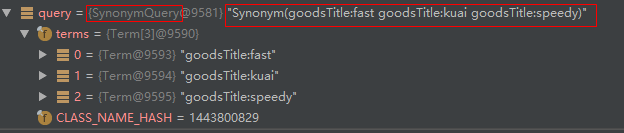
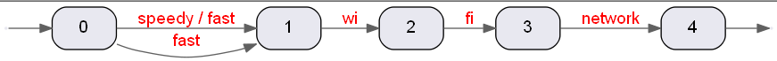
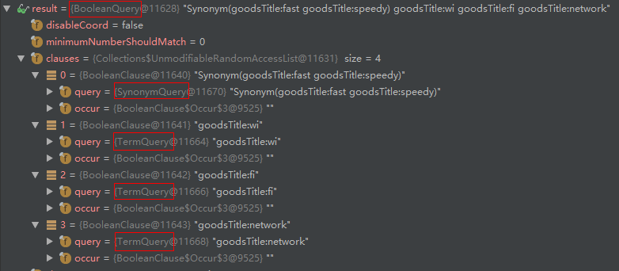
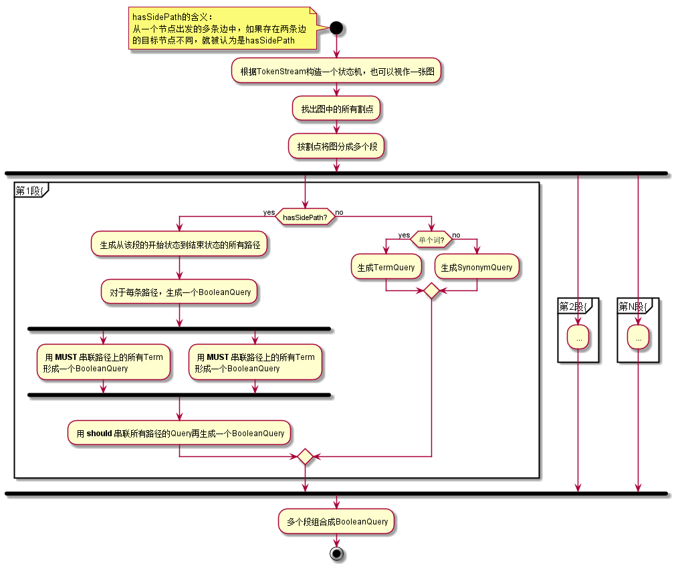
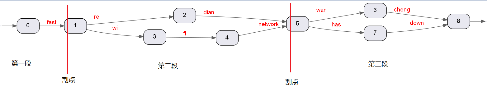
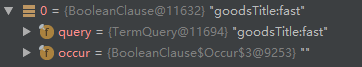
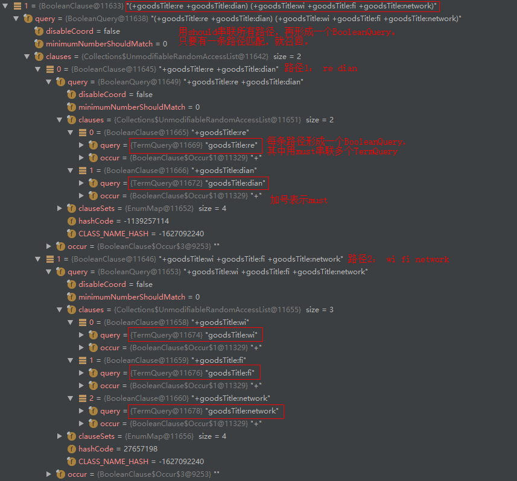
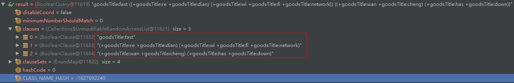

# MatchQuery
MatchQuery是Elasticsearch中一种比较复杂的Query，在查询时会先被改写成一些低级Query的组合。  

## TermQuery、SynonymQuery、BooleanQuery、PhraseQuery简介
// TODO

## MatchQuery改写流程
MatchQuery改写流程的入口: org.elasticsearch.index.search.MatchQuery.MatchQueryBuilder.createFieldQuery(..)  
其中主要调用了父类的实现：org.apache.lucene.util.QueryBuilder.createFieldQuery(..)  

第一步，使用Analyzer对text进行分词，遍历分词结果TokenStream，计算出以下4个值：
1. numTokens: 词的总数
2. positionCount: 位置的总数
3. hasSynonyms: 是否有同义词。只要存在positionIncrement等于0的情况，就认为是同义词。
因此shingle_filter分词的结果也会被当成同义词。
4. isGraph: 是否是图。只要存在positionLength>1的情况，就被认为是图。

```
  int numTokens = 0;
  int positionCount = 0;
  boolean hasSynonyms = false;
  boolean isGraph = false;

  stream.reset();
  while (stream.incrementToken()) {
    numTokens++;
    int positionIncrement = posIncAtt.getPositionIncrement();
    if (positionIncrement != 0) {
      positionCount += positionIncrement;
    } else {
      hasSynonyms = true;
    }

    int positionLength = posLenAtt.getPositionLength();
    if (enableGraphQueries && positionLength > 1) {
      isGraph = true;
    }
  }
```
第二步，根据这4个值来决定不同的分支： 


quoted参数可以控制当positionLength>1时，是改写成PhraseQuery还是多个TermQuery组合成的BooleanQuery。  
一般的MatchQuery中，quoted都为false，因此这里只重点分析quoted==false的情况

### 各分支流程

#### 1. analyzeTerm
当token数量为1时，走analyzeTerm分支，此时MatchQuery被简单的改写成TermQuery

#### 2. analyzeBoolean 
numTokens>1   
isGraph==false  
quoted=false  
positionCount==1  
分词结果中有多个词，但只有1个位置，说明是多个同义词的情况，此时改写成SynonymQuery  

例如，有同义词配置如下：
```
fast, speedy, kuai
```
使用如下查询时：
```
"match": {
  "goodsTitle": "kuai"
}
```
分词结果图示：  
  

这种情况下，MatchQuery被改写为：  


#### 3. analyzeMultiBoolean
numTokens>1   
isGraph==false  
quoted=false  
positionCount>1

词数>1, position数也大于1，但是不是图，即不存在positionLength>1的情况，所有的positionLength都等于1

例如：有同义词配置如下：
```
fast, speedy
```  
使用如下查询时：
```
"match": {
  "goodsTitle": "fast wi fi network"
}
```
分词结果图示：  
   

这种情况下，MatchQuery被改写为：  
  

一个BooleanQuery下4个子句，其中一个SynonymQuery，3个TermQuery, 4个子句都是SHOULD关系。

#### 4. analyzeGraphBoolean
numTokens>1  
isGraph==true  
quoted==false  
这种情况下,分词的结果被视作是一张图, analyzeGraphBoolean流程如下：
    


例如：有同义词配置如下：
```
wi fi network, re dian
has down, wan cheng
（必须使用SynonymGraphFilter, 且expand=true）
```  
使用如下查询时：
```
"match": {
  "goodsTitle": "fast wi fi network has down"
}
```
分词结果图示：  
      
- 首先，找出图的割点集合[1, 5]  
    割点的定义，求割点的Tarjan算法： https://en.wikipedia.org/wiki/Biconnected_component
- 根据割点将图分成3个段： 0~1, 1~5, 5~8 
- 第一段改写成一个简单的TermQuery  

- 第二段  
  
这段查询改写之后语义发生了一些变化，只需要匹配到"wi", "fi", "network"三个词就能召回，不管三个词的位置关系。
实际上应该是短语匹配到"wi fi network"更加准确。Lucene提供了org.apache.lucene.util.QueryBuilder.getAutoGenerateMultiTermSynonymsPhraseQuery()，
支持将同义词改写成短语匹配，但是ES5.6还不支持这个功能。新版本的ES已经支持这个配置，并且已经默认设置为true。  
详见： https://www.elastic.co/guide/en/elasticsearch/reference/6.6/query-dsl-match-query.html#query-dsl-match-query-synonyms  
- 第三段，同第二段类似
- 将三段综合到一个BooleanQuery中

## minimum_should_match
在MatchQuery全部改写完成之后，会应用minimum_should_match参数。  
入口在org.elasticsearch.index.query.MatchQueryBuilder.doToQuery(..)
```
......
Query query = matchQuery.parse(type, fieldName, value);
return Queries.maybeApplyMinimumShouldMatch(query, minimumShouldMatch);
```
MatchQuery的minimum_should_match参数只会被应用到最外层的BooleanQuery上。  
minimum_should_match配置参考：   
https://www.elastic.co/guide/en/elasticsearch/reference/5.6/query-dsl-minimum-should-match.html  

将一个BooleanQuery中的所有Should子句的总数记作optionalClauses
  
| 类型 | 举例 | 描述 |  
| :---: | :---: | :---: |  
| 整数 | 3 | 至少需要匹配3个should子句 | 
| 负整数 | -2 | 至少需要匹配(optionalClauses-2)个should子句 | 
| 百分比 | 75% | 至少需要匹配75%*optionalClauses个should子句 | 
| 负百分比 | -25% | 至少需要匹配optionalClauses*(1-25%)个should子句 |
| 组合形式| 3<90% | 如果optionalClauses<=3,则需要全部匹配<br>如果optionalClauses>3则需要匹配90% | 
| 多重组合形式 | 4<75% 9<3| 如果optionalClauses<=4，则需要全部匹配<br>如果4<optionalClauses<=9,则需要匹配75%<br>如果optionalClauses>9,则至少需要匹配3个

 