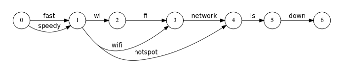

原句： 
```
fast wi fi network is down
```   
同义词配置：   
```
speedy,fast
wi fi network,hotspot
wi fi,wifi
```
分词后结果图


上图中，圆圈表示一个position，箭头表示一个token  

PositionIncrement = 当前token的start - 上一个token的start   
PositionLength = end - start   
对于大文档，PositionIncrement和PositionLength可以明显减少存储空间(见下表最后2行)。  


|token | start | end | PositionIncrement | PositionLength |
|--------  | ---- | ---- |  ---- | ---- |
| fast     | 0    | 1    |  1    |  1   |
| speedy   | 0    | 1    |  0    |  1   |
| wi       | 1    | 2    |  1    |  1   |
| hotspot  | 1    | 4    |  0    |  3   |
| fi       | 2    | 3    |  1    |  1   |
| network  | 3    | 4    |  1    |  1   |
| is       | 4    | 5    |  1    |  1   |
| down     | 5    | 6    |  1    |  1   |
| xxx      |999998|999999|  ?    |  1   |
| yyy      |999999|1000000|  1   |  1   |
 

