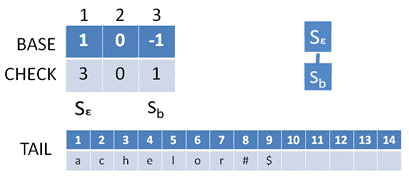
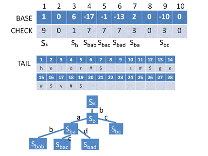
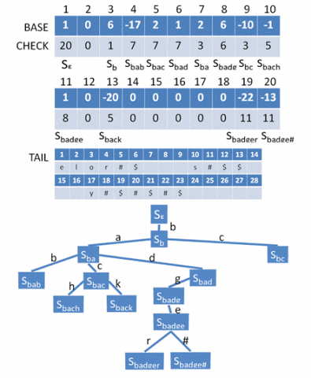
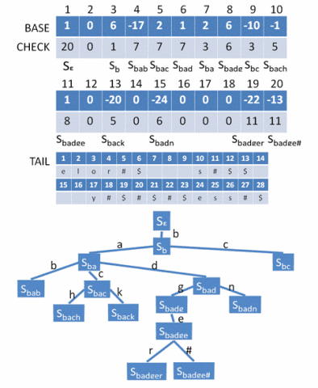

转载自: https://www.cnblogs.com/forfuture1978/p/3940965.html

###双数组Trie树 
#### 1. Trie树 
对于字符串来说，还有一种查询效率较高的数据结构，叫做Trie树(字典树，单词查找树)

比如有一系列的字符串: {bachelor#, bcs#, badge#, baby#, back#, badger#, badness#},之所以在每个字符串后面都加上#, 是希望一个字符串不要成为另一个字符串的前缀。把它们放到Trie树中，如图所示

.jpg)  
在这棵Trie树中，每个节点都包含27个字符，最上面的是根节点，如果字符串的第一个字符是"b", 则"b"位置就有一个指针指向第二层的节点，从这一层开始，下面挂的整棵树，都是以"b"开头的字符串。  
第二层的节点也是包含27个字符，如果字符串的第二个字符是"c"，则"c"位置也有一个指针指向第三层的节点，第三层下面挂的整棵树都是以"bc"为前缀的，以此类推。  
直到碰到"#"，则字符串结束。

通过这种数据结构，对于字符串的查找速度就与字符串的数量无关了，而是与字符串的长度有关。  
但是这种方式空间占用太大，是以指数增长的。

一种改进方式：出现的字符就占用空间，不出现的就不记录  
.gif)    
这也可以看作是一个有限状态机(FSM), 可以识别合法和不合法的输入。  

还可以进一步的简化，有的状态是有多个后续状态的，
比如S<sub>bac</sub>,根据输入的不同进入不同的后续状态。
而有的状态是唯一的，比如当用户到达状态S<sub>bach</sub>后，
此后唯一的合法输入就是"elor#",所以不需要一个个的进入状态，而是直接比较所有剩余的字符串。

所以可以简化成下图的样子，所谓的剩余的字符串，称为后缀。  
.gif)   

#### 2. 双数组Trie树
如何将这个简化了的树形结构更加紧凑的保存起来?   
双数组Trie树(DAT, Double Array Trie)是一种不需要占用太多空间的Trie树，它将上述的树形结构保存在两个数组中。

如果将上面的Trie树看作是一个组织架构图，最上面的根节点是总经理，各个中间节点是各部门的经理，最后的后缀就是普通员工。

现在公司要开会了，需要强行把这个树形结构压扁成数组结构，一个挨一个的坐，那最应该维护的就是上下级关系。  

- 对于总经理，要知道自己的直接下级，以及公司有多少领导干部
- 对于中层领导，要知道自己的上级在哪坐，也要知道自己的下级在哪坐
- 对于基层领导，要知道上级在哪坐，也要知道普通员工在哪坐

双数组Trie树就是一个维护上下级关系的数据结构。它主要包含：
- 两个数组base和check，用来保存和维护领导干部之间的关系
- 一个顺序结构tail，可以在内存中，也可以在磁盘上，用来安排普通员工的座位。
  
更加形象的说法，两个数组就相当于主席台，而员工只有密密麻麻坐在观众席了。 

base和check数组就代表主席台的座位。对于第i位:
- 如果base[i]和check[i]都是0，说明这个位置是空的
- 如果不是空的，则说明坐着一位领导干部
    - base[i]记录一个偏移量offset，通过它，可以计算出下属都坐在什么位置。
    比如领导S<sub>b</sub>有两个下属S<sub>ba</sub>和S<sub>bc</sub>，如果领导S<sub>b</sub>坐在第r个位置，则base[r]中保存了一个偏移量q(q>=1)，  
    对于下属S<sub>ba</sub>,是由S<sub>b</sub>输入"a"到达的，我们将字符"a"编号成一个数字a，  
    则S<sub>ba</sub>就应该坐在q+a的位置，同理S<sub>bc</sub>就应该坐在q+c的位置
    - check[i]存储的是一个下标，通过它，可以知道自己的领导坐在什么位置,  
    比如刚才讲到的下属S<sub>ba</sub>，他坐在q+a的位置，他的领导S<sub>b</sub>坐在第r个位置，那么check[q+a]=r, 同理check[q+c]=r  
    - base[q+a] 和 base[q+c] 存储的就是S<sub>ba</sub>和S<sub>bc</sub>他们的下属的偏移量。
    - 每个人都扮演两种角色，一方面是上司的下属，一方面又是下属的上司，所以每个位子i都有两个数字base[i]和check[i]
    - 对于基层领导稍有不同，因为基层领导的下属就是普通员工了，不坐在双数组主席台上了，而是坐在tail观众席上。  
    所以对于基层领导，如果他坐在第i个位置，则base[i]是一个负值p, p的绝对值表示他的<u>**唯一下属**</u>在tail观众席上的位置。
    
    
至于tail观众席的结构，就非常简单了。一个挨一个的防止，用$符号分割。

根据上述的原理，上面的那棵树保存在双数组中应该如下图:     
   

#### 3. DAT的查询过程
```
//输入: String inputString=”a1 a2 …… an #”转换成为int[] inputCode
boolean doubleArrayTrieSearch(int[] inputCode) {
	int r=1; // 双数组下标 
	int h=0; // 输入串下标
	do {
		int t = BASE[r] + inputCode[h];
		if(CHECK[t] != r){
			//在双数组中找不到相同前缀，说明不存在与这个集合
			// a1 a2 …… ah-1 都相同，ah 不同
			//座位t上坐的不是你的领导，在这棵树上这个字符串找不到组织
			return false;
		} else {
			//前缀暂且相同，继续找下一层状态
			// a1 a2 …… ah 都相同，下个循环比较ah+1
			//说明你属于这个大团队，接着看是否属于某一个小团队
			r = t;
		}
		h = h + 1;
	} while(BASE[r]>0)

	//到这一步双数组中的结构查询完毕，BASE[r]<0，应该从TAIL中查找了
	If（h == inputCode.length - 1）{
		//如果已经到了结束符#，说明这个字符串所有的字符都在双数组中，是个光杆司令
		Return true;
	}
	Int[] tailCode = getTailCode(-BASE[r]);//从TAIL中拿出后缀
	If(compare(tailCode, inputCode, h+1, inputCode.length -1) == 0){
		//比较TAIL中的字符串和inputCode中剩下的”ah+1 …… an #”是否相同，相同则存在
		Return true;
	} else {
		Return false;
	}
}
```

#### 4. DAT的构造过程
一开始整个双数组中只有根节点，然后随着字符串的不断插入而形成。  
要插入一个新的字符串，首先还是要调用查询过程，如果能查到，则说明已经存在，什么都不做，
如果插不到，就需要进行插入操作。  

根据查询过程的代码可以看出，查询无结果也分为两种情况，也就是上面程序中返回false的地方。
1. 在双数组中找不到相同的前缀。即对于输入字符串a<sub>1</sub>a<sub>2</sub>...a<sub>h-1</sub>a<sub>h</sub>a<sub>h+1</sub>...a<sub>n</sub>#,  
    在双数组中a<sub>1</sub>a<sub>2</sub>...a<sub>h-1</sub>能找到对应的状态S, 然而从a<sub>h</sub>开始，找不到对应的状态S'。  
    所以需要将新状态S'作为S的下属加入到双数组中，然后将a<sub>h+1</sub>...a<sub>n</sub>#作为S'的员工放到TAIL中。  
    然而加入时存在一个问题，就是原来的S已经有了一些下属，并经过原来排位置，找到了合适的base值。  
    这时状态S'来了,当它想按照base[r]+a<sub>h</sub>=t找到位置时，发现check[t]<>0,该位置已经有人了。  
    这时候有两种选择:
    - 改变自己的领导S的base值，使得S'和其他下属都能找到空位坐下，这需要对S的所有下属全部迁移。
    - 既然check[t]不为0，说明被别人占了，把占座的人x迁移走。这就导致要将x的领导的所有下属全部迁移。
    
2. 在双数组中找出的前缀相同，但是从tail中取出的后缀和输入不同。即对于输入字符串a<sub>1</sub>a<sub>2</sub>...a<sub>h-1</sub>a<sub>h</sub>a<sub>h+1</sub>...a<sub>n</sub>#,  
    在双数组中，a<sub>1</sub>a<sub>2</sub>...a<sub>h-1</sub>a<sub>h</sub>能找到对应的状态S，而a<sub>h</sub>是基层领导，  
    从tail中找出的后缀和剩余的字符串a<sub>h+1</sub>...a<sub>n</sub>#不同。结果虽不相同，但他们有共同的前缀a<sub>h+1</sub>a<sub>h+2</sub>...a<sub>h+k</sub>，  
    为了区分这是两个不同的字符串团队，他们的共同领导a<sub>h+1</sub>a<sub>h+2</sub>...a<sub>h+k</sub>是要放到双数组中作为中层领导的，  
    而第一个能够区分两个字符串的字符则作为基层领导放到双数组中，后面的部分都放到tail中。

详细流程:

##### 步骤1: 初始状态 
如图，初始状态，创业伊始，仅有根节点（总经理），base[1]=1, check[1]=1, tail为空  
   

##### 步骤2: 加入bachelor#
加入第一个字符串bachelor#, 第一个字符"b"作为基层领导进入双数组，成为总经理的下属  
所以S<sub>b</sub>的位置为base[1]+b = 1+2 = 3, check[3]=0,可以直接插入,再将check[3]置为1,
后缀achelor#进入tail,base[3]=-1,表明S<sub>b</sub>为基层领导，员工在tail中的偏移量为1  


##### 步骤3: 加入bcs# 
加入bcs#, 找到状态S<sub>b</sub>,是基层领导，从tail中读出后缀进行比较，achelor#和cs#，两者没有共同的前缀，所以将a和c放入双数组中作为基层领导区分两个字符串团队即可。  
新加入的两个状态S<sub>ba</sub>和S<sub>bc</sub>都是状态S<sub>b</sub>的下属,所以先求base[3]=q的值:  
假设q=1, 1+a=1+1=2, 1+c=1+3=4, check[2]和check[4]都为0，可以用来放S<sub>ba</sub>和S<sub>bc</sub>。  
因此: 
- base[3]=1, check[2]=3, check[4]=3
- 两个后缀chelor#和s#放入tail
- base[2]=-1,指向tail中的后缀chelor#;  base[4]=-10,指向tail中的后缀s#


##### 步骤4: 加入badge# 
加入badge#, 找到状态S<sub>ba</sub>,是基层领导, 从tail中读取后缀chelor#和dge#进行比较，没有共同前缀,  
于是将字符c和d放入双数组作为基层领导来区分两个字符串团队，形成状态S<sub>bac</sub>和S<sub>bad</sub>，都作为S<sub>ba</sub>的下属。  
于是要计算S<sub>ba</sub>的base[2]=q的值： 
- 假设q=1, 1+c=1+3=4, 1+d=1+4=5, 由于check[4]不为0，产生冲突。
- 假设q=2, 2+c=5, 2+d=6, check[5]和check[6]都为0，可以放入  
所以:
- base[2]=2, check[5]=2, check[6]=2
- 两个后缀helor#和ge#放入tail, 
- 基层领导S<sub>bac</sub>的base[5]=-1,指向tail中的helor#后缀; S<sub>bad</sub>的base[6]=-13,指向tail中的ge#后缀  


##### 步骤5: 加入baby# 
加入baby#, 找到状态S<sub>ba</sub>,有两个下属是S<sub>bac</sub>和S<sub>bad</sub>，要将S<sub>bab</sub>加入到双数组中。  
当前S<sub>ba</sub>的base[2]=2,根据它来安排S<sub>bab</sub>的位置, 2+b=4，然而check[4]!=0,有冲突。  
有两种选择: 
- 改变S<sub>ba</sub>的base[2]的值，造成S<sub>bac</sub>,S<sub>bad</sub>,S<sub>bab</sub>都要移动
- 移动第4位的状态S<sub>bc</sub>, 先要找到他的领导S<sub>b</sub>，要移动S<sub>bc</sub>,需要修改S<sub>b</sub>的base[3]的值。  
   如果被修改，则状态S<sub>ba</sub>和S<sub>bc</sub>需要移动。
     
权衡两种选择，选择后者。原来base[3]=q=1,
- 假设q=2, 2+a=3, 2+c=5, check[3]不为0， 有冲突
- 假设q=3, 4, 5 , 也有冲突
- 假设q=6, 6+a=7, 6+c=9, check[7]和check[9]都不为0，可以用来放S<sub>ba</sub>和S<sub>bc</sub>

因此: 
- base[3]=6, S<sub>ba</sub>从第2个位置移动到第7个位置，S<sub>bc</sub>从第4个位置移动到第9个位置, check[7]和check[9]置为3  
- S<sub>bab</sub>放在第4个位置，check[4]=7 
- 后缀y#进入tail, S<sub>bab</sub>的base[4]=-17指向tail中的后缀y#


##### 步骤6: 加入back# 
加入back#, 找到状态S<sub>bac</sub>, 是一个基层领导，从tail中读取的后缀helor#和k#比较没有共同后缀，  
需要将h和k放到双数组中，成为状态S<sub>bach</sub>和S<sub>back</sub>。计算S<sub>bac</sub>的base[5]=q:
- 假设q=1, 1+k=12, 1+h=9, 由于check[9]!=0，有冲突
- 假设q=2, 2+k=13, 2+h=10, check[10]和check[13]都为0，满足条件  
因此: 
- base[5]=2, check[10]=5, check[13]=5。
- 后缀elor#和#进入tail
- base[10]=-1, base[13]=-20  


##### 步骤7: 加入badger# 
加入badger#，找到状态S<sub>bad</sub>，是基层领导，从tail中读取后缀ge#和ger#进行比较，有共同前缀ge，  
所以需要将g和e放入双数组作为中层领导，形成S<sub>badg</sub>和S<sub>badge</sub>，  
另外#和r需要放入双数组作为基层领导，形成状态S<sub>badge#</sub>和S<sub>badger</sub>  

先放入状态S<sub>badg</sub>，他的领导是S<sub>bad</sub>，计算base[6]=q
- 假设q=1, 1+g=8满足条件  
因此:
- base[6]=1, check[8]=6

然后放入状态S<sub>badge</sub>, 他的领导是S<sub>badg</sub>, 计算base[8]=q, 
- 假设q=1, 1+e=6, 由于check[6]!=0, 冲突
- 假设q=2,3,4,5, 都有冲突
- 假设q=6, 6+e=11, check[11]!=0, 满足条件  
因此: 
- base[8]=6, check[11]=8

最后放入状态S<sub>badge#</sub>和S<sub>badger</sub>，他们的领导是S<sub>badge</sub>，计算base[11]=q
- 假设q=1, 1+r=19, 1+#=20,由于check[19]和check[20]都为0，满足条件。  
因此
- base[11]=1, check[19]=11, check[20]=11
- 后缀#和空后缀进入tail, 
- base[19]=-22, base[20]=-13指向tail中的空后缀 


##### 步骤8: 加入badness#  
加入badness#, 找到状态S<sub>bad</sub>, 不是基层领导，有下属S<sub>badg</sub>,   
所以要将状态S<sub>badn</sub>加入双数组，后缀ess#加入tail中。  
S<sub>badn</sub>的领导S<sub>bad</sub>的base[6]=1, 1+n=15, check[15]=0, 满足条件


 


