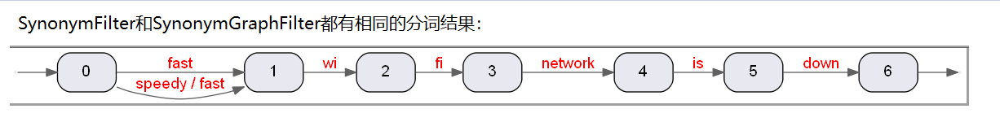
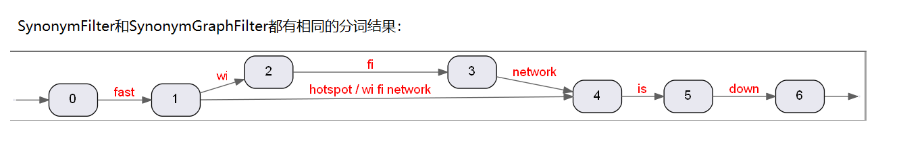
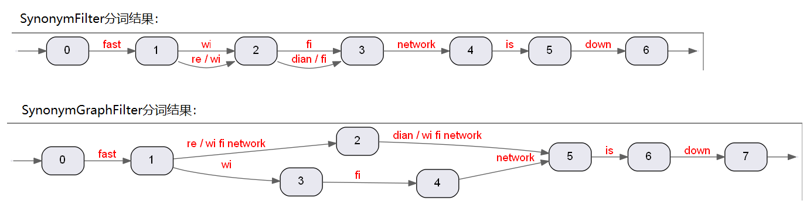

# Lucene中的同义词
Lucene的TokenFilter中，有SynonymFilter和SynonymGraphFilter两种来处理同义词。  
SynonymFilter不能很好的处理多词同义词，已经被弃用，建议使用SynonymGraphFilter  

## SynonymFilter 和 SynonymGraphFilter的比较
假设有如下文本：
```
fast wi fi network is down
```
#### 一到一的同义词映射
同义词配置如下：
```
fast, speedy 
(expand = true)
```


#### 一到多的同义词映射
同义词配置如下：
```
wi fi network, hotspot
(expand = true)
```


#### 多到多的同义词映射
同义词配置如下： 
```
wi fi network, re dian
(expand = true)
```


这种情况下，SynonymGraphFilter能产生正确的分词结果，而SynonymFilter的结果是错误的。

## 同义词的匹配规则
SynonymFilter和SynonymGraphFilter都使用正向最大匹配规则。比如有如下的同义词配置： 
```
   a -> x
   a b -> y
   b c d -> z
```
当输入  a b c d e 时会被解析成 y b c d

因为a b在 "a b c d e"中出现的最早，且最长。 

## TODO
1. 索引时是否要使用FlattenGraphFilter？ 

2. ShingleFilter 与同义词的冲突

3. 倒排索引中只存储positionIncrement,不存储positionLength（默认认为所有的positionLength都是1），
因此会丢失掉同义词的图结构。（参考org.apache.lucene.index.FieldInvertState）

4. 索引时不考虑同义词，查询时expand=true？
目前线上应用的是 expand=false, 改成true之后可能会有性能问题，因为GB目前配置了大量了多语言到英语的等效同义词。

5. 如果索引时不考虑同义词，那么现在线上的动态同义词插件就能很好的work，定时加载新的同义词配置，
只在查询时应用。目前的情况时，定时加载同义词配置后，已经索引了的文档不能再使用新的同义词配置，
导致索引时和查询时的配置冲突，无法召回文档。必须重刷索引。 