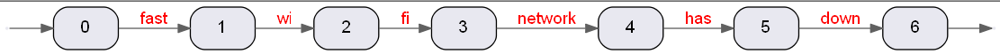
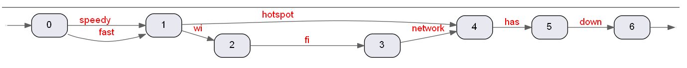
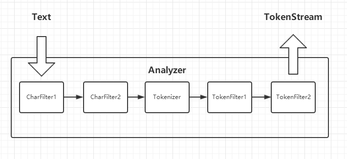

# Lucene分词基本概念
Lucene接收纯文本，分词之后写入索引。  
分词就是将一段文本拆分成多个词(Token)，并产生与每个词相关联的一些属性(Attribute)的过程。  

## TokenStream、PositionIncrement和PositionLength
Lucene用TokenStream来表示分词的结果。一般情况下，TokenStream可以看做是一个顺序的Token流。  
例如，有一段文本：
```
fast wi fi network has down
```
分词之后产生的TokenStream如下图:
  

但是，有些情况下的分词结果是一张图。例如，添加以下同义词配置：
```
wi fi network, hotspot
speedy, fast
```  
分词之后产生的TokenStream如下图：
  

一个正确的分词结果应该满足这样的条件：**从任何一条路径顺序遍历这张图，得到的结果都与原句语义相同。** 

图中的每一个节点代表一个position，每一条边代表一个Token，每一个Token有startPosition和endPosition两个属性。
  
| token序号 | token | startPosition | endPosition |     
| :---: | :---: | :---: | :---: |    
| 1 | speedy | 0 | 1 | 
| 2 | fast | 0 | 1 |
| 3 | hotspot | 1 | 4 |
| 4 | wi | 1 | 2 |
| 5 | fi | 2| 3 |
| 6 | network | 3 | 4 |
| 7 | has | 4 | 5 |
| 8 | down | 5 | 6 |

StartPosition和endPosition已经足以描述一个token的位置信息，但是Lucene采用的是另外两种属性：
- positionIncrement : 表示当前token相对于上一个token的位置增量  
    positionIncrement = 当前token的startPosition - 上一个token的startPosition
- positionLength : 表示当前token的position跨度  
    positionLength = 当前token的endPosition - 当前token的startPosition

| token序号 | token | startPosition | endPosition | positionIncrement | positionLength    
| :---: | :---: | :---: | :---: | :---: | :---: |    
| 1 | speedy | 0 | 1 | 1 | 1 
| 2 | fast | 0 | 1 | 0 | 1  
| 3 | hotspot | 1 | 4 | 1 | 3 
| 4 | wi | 1 | 2 | 0 | 1 
| 5 | fi | 2| 3 | 1 | 1 
| 6 | network | 3 | 4 | 1 | 1 
| 7 | has | 4 | 5 | 1 | 1 
| 8 | down | 5 | 6 | 1 | 1 
| ...| 
| .. | xxx | 999998 | 999999 | 1 | 1
| .. | yyy | 999999 | 1000000 | 1 | 1 

对于比较大的文档，positionIncrement和positionLength的值会比startPosition和endPosition小很多（例如上表中的最后两行），
这可以显著的减少Lucene索引文件的大小。
## Lucene分词的核心组件
- CharFilter : 在分词之前，对文本进行一些转换。通常是一些字符层面的操作。例如： 
    - MappingCharFilter可以将à转换成a
    - HTMLStripCharFilter可以去除文本中的HTML标签
- Tokenizer : 基于某种规则进行分词。例如：
    - WhitespaceTokenizer可以按空格来分词。     
- TokenFilter ： 对Tokenizer产生的结果进一步的处理。例如：
    - PorterStemFilter可以对token进行词干提取
    - LowerCaseFilter可以将token转换成小写形式
    - SynonymFilter可以完成同义词的映射
- Analyzer : Analyzer本身不负责任何分词相关的工作，但它负责组装和构造CharFilter, Tokenizer和TokenFilter。
Lucene在索引和查询时都只与Analyzer交互。


CharFilter是java.io.Reader的子类，它装饰另外一个java.io.Reader，做一些字符层面的转换工作，  
并记录每个字符在原文本中的偏移量offset, 一个Analyzer中可以有多个CharFilter链式的工作
  
Tokenizer本身就是TokenStream的子类，它就已经可以看作是分词的结果。
一个Analyzer中只能一个Tokenizer  

TokenFilter也是TokenStream的子类，一个Analyzer中可以有0个或多个TokenFilter，用来修饰Tokenizer的结果。

  

## 与Token关联的属性
Lucene用Attribute来表示与Token关联的各种属性。例如： 
- CharTermAttribute表示Token的文本内容
- OffsetAttribute表示Token在原文本中的字符 起始偏移量和结束偏移量(startOffset & endOffset)
- PositionIncrementAttribute 和 PositionLengthAttribute 表示Token位置相关的属性  
    
## Lucene分词API示例
```
@Test
public void testAnalyzer() throws IOException {
    Analyzer analyzer = new Analyzer() {

        @Override
        protected Reader initReader(String fieldName, Reader reader) {
            return new HTMLStripCharFilter(reader); // 去除HTML标签
        }

        @Override
        protected TokenStreamComponents createComponents(String fieldName) {
            Tokenizer tokenizer = new WhitespaceTokenizer();  // 空格分词
            TokenStream ts = new LowerCaseFilter(tokenizer);  // 转小写
            ts = new PorterStemFilter(ts);  // 词干提取
            return new TokenStreamComponents(tokenizer, ts);
        }
    };
    final String text = "<b>CAT running</b>";
    TokenStream ts = analyzer.tokenStream("", text);
    CharTermAttribute charTermAtt = ts.getAttribute(CharTermAttribute.class);
    ts.reset();
    while (ts.incrementToken()) {
        String term = charTermAtt.toString();
        System.out.println(term); // 结果： cat   \n  run 
    }
}
```    