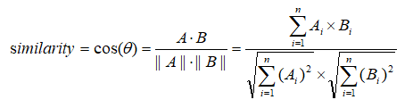

### 一、匹配 & 打分  
Lucene使用 布尔模型(Boolean model) 查找匹配文档，并用一个名为 "实用评分函数(practical scoring function)" 的公式来计算相关度。
这个公式借鉴了 词频/逆向文档评率(term frequency/inverse document frequency, TF/IDF) 和 向量空间模型(vector space model, VSM)，
同时也加入了一些现代的新特性，如协调因子(coordination factor), 字段长度归一化(field length normalization), 以及词或查询语句权重提升。 

- 布尔模型 ： 判断文档是否匹配
- TF/IDF : 计算单个Term的权重
- 向量空间模型 ： 提供一种合并多Term权重的方式

### 二、布尔模型
布尔模型(Boolean Model)只是在查询中使用AND, OR, NOT这样的条件来查找匹配的文档，以下查询:
```
full AND text AND search AND (elasticsearch OR lucene)
```
会将所有包括词full、text和search，以及elasticsearch或lucene的文档作为结果集。  
这个过程简单且快速，它将所有不可能匹配的文档排除在外。 

### 三、词频/逆向文档频率 (TF/IDF)
当匹配到一组文档后，需要根据相关度排序这些文档，不是所有文档都包含所有词，有些词比其他的词更重要。
一个文档的相关度评分 部分取决于 每个查询词在文档中的 **权重**。

词的权重由以下三个因素决定(下面提到的文档都理解为字段更加合适):
#### 1.词频(Term frequency)
词在文档中出现的频次是多少？ 频次越高，权重越高。 5次提到同一词的字段比只提到1次的更相关。  
词频的计算方式如下：   
  
- 词t在文档d的词频(tf)是该词在文档中出现次数的平方根
如果不在意词在某个字段中出现的频度，而只在意是否出现过，则可以在mapping中禁用词频统计:
```
PUT /my_index
{
  "mappings": {
    "doc": {
      "properties": {
        "text": {
          "type":          "string",
          "index_options": "docs"       ## 禁用词频统计
        }
      }
    }
  }
}
```  
#### 2.逆向文档频率(Inverse document frequency)
词在所有文档中出现的频次是多少？频次越高，权重越低。  
常用词如and 或 the对相关度贡献很少,因为它们在多数文档中都会出现。  
一些不常见的词如elastic可以帮助我们快速缩小范围找到感兴趣的文档。
逆向文档频率的计算公式如下：  
  
- 索引中文档总数除以所有包含该词的文档数，然后求对数。
#### 3.字段长度归一值(field-length norm)
字段的长度是多少？字段越短，字段的权重越高。  
如果词出现在类似标题title这样的字段，要比它出现在内容body这样的字段中的相关度更高。  
字段长度的归一值公式如下：  
      
- 字段长度归一值是字段中词数平方根的倒数。
对于一些应用场景如日志，归一值不是很有用，要关心的只是字段是否包含特殊的错误码或者特定的浏览器唯一标识符。
字段的长度对结果没有影响，**禁用归一值可以节省大量内存空间**。  
可以通过mapping来禁用归一值:
```
PUT /my_index
{
  "mappings": {
    "doc": {
      "properties": {
        "text": {
          "type": "string",
          "norms": { "enabled": false }  ##禁用归一值
        }
      }
    }
  }
}
```

### 四、向量空间模型(vector space model)
向量空间模型提供一种比较多Term查询的方式，可以用单个评分代表文档与查询的匹配程度，
为了做到这点，这个模型将文档和查询都以向量(vectors)的形式表示：  
向量实际上就是包含多个数的一维数组，例如:
```
[1, 2, 5, 22, 3, 8]
```
在向量空间模型里，每个数字都代表一个词的权重  

假设要查询"happy hippopotamus", 常见词happy的权重较低，不常见词hippopotamus权重较高，
假设happy的权重是2， hippopotamus的权重是5，那么这个查询的向量表示就是[2,5]

再假设我们有3个文档：
```
1. I am happy in summer.
2. After Christmas I'm a hippopotamus.
3. The happy hippopotamus helped Harry.
```
可以为每个文档都创建包括每个查询词(happy & hippopotamus)的权重向量：
```
文档 1： (happy,____________) —— [2,0]
文档 2： ( ___ ,hippopotamus) —— [0,5]
文档 3： (happy,hippopotamus) —— [2,5]
``` 
向量之间是可以比较的，只要测量查询向量和文档向量之间的角度就可以得到每个文档的相关度。

用向量的余弦相似度计算公式如下：  
    


