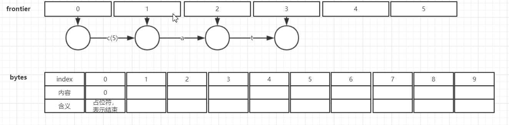
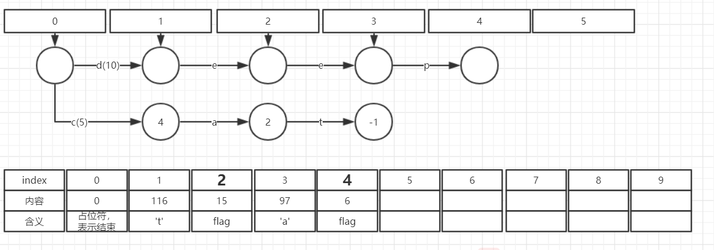
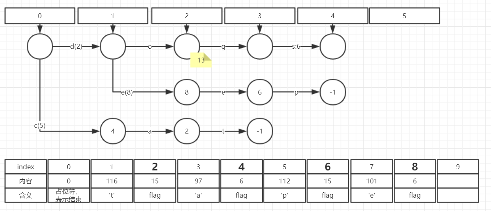
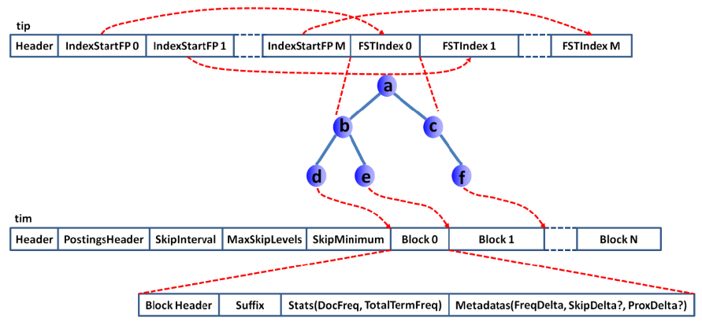

# Lucene FST 
## 1. FST简介
FST, 全称Finite State Transducer, 中文翻译: 有限状态转换器或有限状态传感器。
FST最重要的功能是可以实现Key到Value的映射，相当于HashMap<Key,Value>。FST的内存消耗要比HashMap少很多，
但FST的查询速度比HashMap要慢。FST在Lucene中被大量使用，例如：倒排索引的存储，同义词词典的存储，搜索关键字建议等。 

## 2. FST定义 
一个FST是一个6元组 (Q, I, O, S, E, f):  
- Q是一个有限的**状态**集
- I是一个有限的**输入符号**集
- O是一个有限的**输出符号**集
- S是Q中的一个状态，称为**初始状态**
- E是Q的一个子集，称为**终止状态**集 
- f是转换函数, f ⊆ Q × (I∪{ε}) × (O∪{ε}) × Q，其中ε表示空字符。
即从一个状态q1开始，接收一个输入字符i，可以到达另一个状态q2，并产生输出o。

例如有下面一组映射关系：  
cat -> 5  
deep -> 10   
do -> 15   
dog -> 2  
dogs -> 8    
可以用下图中的FST来表示：  
  
- 圆圈A~I表示状态集
- 输入符号为字母{a,c,d,e,g,p,t,o...}
- 输出符号为正整数
- 绿色圆圈A为初始状态
- 粉色圆圈E、H、I为终止状态。
- 终止状态节点也可以有输出，称为Final Output。例如上图中，状态E的Final Output = 13 

FST查询时，从初始状态开始，沿箭头走到终止状态，途中所有的边的输出之和再加上终止状态的Final Output即为最终的输出。例如：
- 查询cat，结果为5
- 查询do， 结果为2+13=15
- 查询dogs， 结果为2+6=8
 
## 3. Lucene中的FST
Lucene中已经有FST的开源实现，在org.apache.lucene.lucene_core.util.fst包下，我使用的lucene版本为6.6.1。  
lucene中的FST有以下特性：  
- 构建最小FST的过程快速且内存消耗低(但是**输入必须有序**)
- 构建完毕之后，整个FST全部用byte[]表示，反序列化快速且 Object的内存额外消耗低
- 支持按Output查找,如果Output是有序的话
- 可插拔的Outputs表示法，支持字符串、正整数等多种输出类型。 
- 可以顺序迭代每一对<输入, 输出>   

## 4. Lucene中FST的存储
先对上面的FST稍作变形：  
  

再使用一个byte[]来存储整个FST：
  
- 整个byte[]数组是倒序的，查询时从后往前阅读。
- 每一个节点圆圈中的数字对应了该节点在byte[]中的起始位置。从某一个节点的起始位置开始，到下一个节点的起始位置结束，
为该节点的全部内容。 例如byte[]中(27,26,25,24,23,22,21)位置为节点27的全部内容。
- byte[0] = 0 ，表示图中的-1节点，在查询时表示FST的结束。
- 没有存储任何节点相关的属性，所有的信息都以边(Arc)的属性给出。 
- 对于每一个节点，在byte[]按输入符号顺序存储每一条边的信息。例如，对于节点27，  
(27,26,25,24)存储了它的第一条边的信息：输入符号为'c',输出符号为5，目标节点为4  
(23,22,21)存储了它的第二条边的信息：输入符号为'd'，输出符号为2
- 对于每一条边，都以一个标识位flag开始，flag占一个字节，总共8bit，其中：
    - 第一位为BIT_FINAL_ARC，表示此边的目标节点是否为可接受状态
    - 第二位为BIT_LAST_ARC，表示此边是节点的最后一条边，此边后面的内容就是下一个节点了。一个节点的所有边按顺序写入到bytes中，只有最后一条边被标记为BIT_LAST_ARC
    - 第三位为BIT_TARGET_NEXT，表示此边应用了target_next优化，bytes中的下一个Node就是此边的目标节点。   
    例如：节点27的第二条边(23,22,21)并没有存储target，因为它的下一个节点20就是它的目标节点。  
    如果BIT_TARGET_NEXT = 0，则该ARC需要存储target信息。  
    - 第四位为BIT_STOP_NODE，表示此边的目标节点是-1，已经遍历到了FST的末尾。
    - 第五位为BIT_ARC_HAS_OUTPUT，表示此边有输出。  
    如果BIT_ARC_HAS_OUTPUT = 1，则该ARC需要存储output信息。
    - 第六位为BIT_ARC_HAS_FINAL_OUTPUT，表示此边的目标节点有输出(final output)
    如果BIT_ARC_HAS_FINAL_OUTPUT = 1，则该ARC需要存储final output信息
    - 第7位为BIT_TARGET_DELTA，表示此边的目标节点以差值编码方式存储。 
    当一个节点的边数目太多时，顺序遍历耗时太长，此时改用定长的格式来存储每一条边，在查询时使用二分查找加速查询。
    由于一个节点的所有Arc是集中分布的，此时每条边的target可以用差值编码的方式来存储，节省空间。
    - 第8位未使用  
     
  以节点27为例：
  1. 第一条边flag=16，二进制为 ‭00010000‬ 。
  第三位为BIT_TARGET_NEXT=0，因此有目标节点target=4； 
  第五位为BIT_ARC_HAS_OUTPUT=1，因此有输出符号output=5
  2. 第二条边flag=22, 二进制为‭ 00010110‬ 。  
  第二位BIT_LAST_ARC=1，说明这是节点27的最后一条边；
  第三位BIT_TARGET_NEXT=1，因此不需要存储target，其目标节点为下一个节点，也就是20；
  第五位为BIT_ARC_HAS_OUTPUT=1，因此有输出符号output=2


## 5. Lucene FST的构造API
Lucene使用Builder类来构造一个FST，一个示例如下:  
```
String inputValues[] = {"cat", "deep", "do", "dog", "dogs"};
long outputValues[] = {5, 10, 15, 2, 8};

PositiveIntOutputs outputs = PositiveIntOutputs.getSingleton();
Builder<Long> builder = new Builder<Long>(FST.INPUT_TYPE.BYTE1, outputs);
IntsRefBuilder scratchInts = new IntsRefBuilder();
for (int i = 0; i < inputValues.length; i++) {
    BytesRef scratchBytes = new BytesRef(inputValues[i]);
    builder.add(Util.toIntsRef(scratchBytes, scratchInts), outputValues[i]);
}
FST<Long> fst = builder.finish();
```
1. 构造一个Builder对象，Builder(INPUT_TYPE inputType, Outputs<T> outputs)。  
其中inputType指明每一个输入符号占几个字节，有BYTE1, BYTE2, BYTE4三个可选值  
outputs则是FST的输出的运算抽象 
2. 依次加入每一对<输入，输出>对(输入必须有序)。调用add(IntsRef input, T output)。  
这里将输入串看作一个int[]， 但实际每一个输入符号占几个字节还是由INPUT_TYPE决定。 
3. 调用builder.finish()，生成FST

## 6. Lucene FST的构造过程图示 
Lucene FST在构造完毕之后，所有数据都存储在一个byte[]之中(反向排列)，没有任何多余的对象。 
但是在构造过程中，需要Node（节点）和Arc（边）两类对象来辅助构造。  
Lucene FST中的Node分为两种：
- CompiledNode : 表示这样一类Node，他们已经被写入到bytes中，并确定了在bytes中的位置。 这类Node只需要存储其在bytes中的位置，占用内存少。
- UnCompiledNode :  还未写入到bytes中的Node，这类Node需要存储的信息比较多。

Builder类主要维护两部分数据：
- BytesStore bytes  ：可以看做是一个字节数组，最终用来存储FST的二进制表示。
- UnCompiledNode<T>[] frontier ： 用来辅助构造 

下面是FST构造过程中，frontier和bytes的变化过程。在下面的图中：
- frontier第一行的圆圈表示UnCompiledNode
- 后面各行的圆圈都表示CompiledNode
- 每一条边上，"c(5)"表示输入字符为'c'，输出为5； "a"表示输入字符为'a'，无输出(或者输出为0)
- 黄色标签表示节点的Final Output 
- bytes中一个粗体的位置表示一个Node的开始。

### （1） 调用new Builder()   
此时frontier中为空  
初始化bytes，并写入一个0，表示FST的结束。   
### （2） 插入cat -> 5  
   

### （3） 插入deep -> 10   
Builder.add(IntsRef input, T output)方法主要有以下四个步骤：
- 计算当前字符串和上一个字符串的公共前缀
- 调用freezeTail方法, 从尾部一直到公共前缀的节点，将已经确定的状态节点冻结。
这里会将UncompiledNode序列化到bytes当中，并转换成CompiledNode。 
- 将当前字符串形成状态节点加入到frontier中
- 调整每条边输出值。   
   

### （4） 插入do -> 15  
  

### （5） 插入dog -> 2   
do->15, dog->2    
此时无论怎么调整边的值，都无法满足要求(必须在正数范围内)。因此引入一个新的概念Final output ,即下图中的黄色注释部分。 
对于每一个终止状态，可以有一个Final output。从起始状态遍历到终止状态:  
output1 + output2 + ... + outputN + FinalOutput = 最终输出 
  

### （6） 插入dogs -> 8 
  

### （7） 调用Builder.finish
  

至此， FST已经全部构造完成。 frontier可以全部丢弃，只留下bytes即可。  


## 7. FST和HashMap 比较 
HashMap的结构如下图：
- 一个Node<K,V>[] table数组作为hash表，table长度始终为2的整数次幂(2^p)，
- map.size / table.length 不能超过负载因子（默认为0.75），超过后table会自动扩容为原来长度的2倍。
- 对于每个插入的Entry<Key, Value>， 使用Key的hashCode()的最后p位作为它在table中的位置。 
- 当发生hash冲突时，采用拉链法存储冲突的节点
- 当一个位置存储的节点超过8时，改用二叉排序树存储冲突的节点。 


HashMap的Key，Value，Entry等都以对象的形式存储，因此对象的额外占用内存很多。但HashMap一般有比较快的查询速度。

FST压缩率一般在3倍~20倍之间，相对于TreeMap/HashMap的膨胀3倍，内存节省就有9倍到60倍(摘自https://blog.csdn.net/whinah/article/details/9980893)
  
使用132762个<英文单词, 随机正整数>键值对(txt文件，2313KB)来构造FST和HashMap，对比结果如下：

|  | FST | HashMap | 比较
| :---: | :---: | :---: | :---: |
| 占用内存 | 1194KB | 19682KB | HashMap的内存使用量约为FST的16倍
| 1000W个随机Key查询时间 | 12500ms | 1300ms | FST的查询耗时大约为HashMap的10倍


## 8. FST在Lucene中的应用
1. MappingCharFilter中，用来存储字符的映射关系。例如: á => a，é => e
2. SynonymMap中，用来存储同义词的配置。 例如： 西红柿，番茄
3. Suggest功能中大量使用（详见Lucene FST的第N小路径(N-shortest paths by weight)）
4. Lucene在存储倒排索引时，分为2个文件: 词典文件(.tim), 词典索引文件(.tip)。其中.tip中存储的就是多个FST，
FST中存储的是<单词前缀，以该前缀开头的所有Term的压缩块在磁盘中的位置>。  


## 9. Lucene FST的查询API
```
BytesRef bytesRef = new BytesRef("dog");
IntsRef intsRef = Util.toIntsRef(bytesRef, new IntsRefBuilder());
Long result = Util.get(fst, intsRef);
```
Util.get()方法：
```
  /** Looks up the output for this input, or null if the
   *  input is not accepted. */
  public static<T> T get(FST<T> fst, IntsRef input) throws IOException {

    // TODO: would be nice not to alloc this on every lookup
    final Arc<T> arc = fst.getFirstArc(new Arc<T>());

    final BytesReader fstReader = fst.getBytesReader();

    // Accumulate output as we go
    T output = fst.outputs.getNoOutput();
    for(int i=0;i<input.length;i++) {
      if (fst.findTargetArc(input.ints[input.offset + i], arc, arc, fstReader) == null) {
        return null;
      }
      output = fst.outputs.add(output, arc.output);
    }

    if (arc.isFinal()) {
      return fst.outputs.add(output, arc.nextFinalOutput);
    } else {
      return null;
    }
  }
```

## 10. Lucene FST的遍历API
```
FST<Long> fst = buildFST();
IntsRefFSTEnum<Long> fstEnum = new IntsRefFSTEnum<>(fst);
IntsRefFSTEnum.InputOutput<Long> inputOutput;
BytesRefBuilder scratch = new BytesRefBuilder();
while ((inputOutput = fstEnum.next()) != null) {
    String input = Util.toBytesRef(inputOutput.input, scratch).utf8ToString();
    Long output = inputOutput.output;
    System.out.println(input + "\t" + output);
}
```
## 11. Lucene FST的第N小路径(N-shortest paths by weight)
也就是在FST上应用Dijikstra求最短路径。
```
@Test
public void testShortestPath() throws IOException {
    final String userInput = "do"; // 假如用户输入了"do"
    BytesRef bytesRef = new BytesRef(userInput);
    IntsRef input = Util.toIntsRef(bytesRef, new IntsRefBuilder());

    FST<Long> fst = buildFST();

    // 从开始位置走到"do"位置
    FST.Arc<Long> arc = fst.getFirstArc(new FST.Arc<>());
    FST.BytesReader fstReader = fst.getBytesReader();
    for (int i = 0; i < input.length; i++) {
        if (fst.findTargetArc(input.ints[input.offset + i], arc, arc, fstReader) == null) {
            System.out.println("没找到。。。");
            return;
        }
    }

    // 从"do"位置开始找走到终止状态最近的2条路径
    Util.TopResults<Long> results = Util.shortestPaths(fst, arc, PositiveIntOutputs.getSingleton().getNoOutput(), new Comparator<Long>() {
        @Override
        public int compare(Long o1, Long o2) {
            return o1.compareTo(o2);
        }
    }, 2, false);

    // 打印结果： dog  dogs。 即用户输入"do"，给用户建议"dog"和"dogs"
    BytesRefBuilder bytesRefBuilder = new BytesRefBuilder();
    for (Util.Result<Long> result : results) {
        IntsRef intsRef = result.input;
        System.out.println(userInput + Util.toBytesRef(intsRef, bytesRefBuilder).utf8ToString());
    }
}
```

## 12. 参考资料
FST定义：https://en.wikipedia.org/wiki/Finite-state_transducer   
FST图示：http://examples.mikemccandless.com/fst.py  
https://www.cnblogs.com/forfuture1978/p/3945755.html  
http://blog.sina.com.cn/s/blog_4bec92980101hvdd.html  
https://www.cnblogs.com/bonelee/p/6226185.html  
https://blog.csdn.net/whinah/article/details/9980893  
