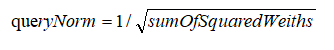

对于多词查询，Lucene使用布尔模型、TF/IDF以及VSM，然后将它们组合到单个高效的包里，以收集匹配文档并进行评分计算。

一个多词查询
```
GET /my_index/doc/_search
{
  "query": {
    "match": {
      "text": "quick fox"
    }
  }
}
```
会在内部被重写为：
```
GET /my_index/doc/_search
{
  "query": {
    "bool": {
      "should": [
        {"term": { "text": "quick" }},
        {"term": { "text": "fox"   }}
      ]
    }
  }
}
```
bool查询实现了布尔模型，在这个例子中，它会将包含词quick或fox或两者都有的文档作为查询结果。

只要一个文档与查询匹配，Lucene就会为查询计算评分，然后合并每个匹配词的评分结果。  
这里使用的评分计算公式叫"实用评分函数(practical scoring function)", 公式如下：  
  
1. score(q,d)是文档d与查询q的相关度评分
2. queryNorm(q)是 查询归一化因子 (新)
3. coord(q,d)是 协调因子(新)
4. 查询q中每个词t对于文档d的权重和
5. tf(t in d)是词t在文档d中的词频
6. idf(t) 是词t的逆向文档频率
7. t.getBoost()是 查询时的boost (新)
8. norm(t,d)是 字段长度归一值 与 索引时boost(如果存在) 结合后的值

### 查询归一因子
查询归一因子(queryNorm) 试图将查询归一化，这样就能将两个不同的查询结果相比较。
但它并不是十分有效， 因为相关度评分_score的目的就是为了将当前query的结果进行排序，比较不同查询结果的相关度评分没有太大意义。

这个因子只与Query相关，一个典型的实现如下：  

- sumOfSquaredWeights是查询里每个词的IDF的平方和

### 查询协调因子
查询协调因子(coord)可以为那些匹配到更多Term的文档提供奖励。文档匹配到的Term越多，它越有机会成为好的结果。

假设Query为： quick brown fox, 每个词的权重都是1.5。如果没有协调因子，最终评分会是文档里所有Term的权重之和。  
例如：
- 文档里有fox -> 评分：1.5
- 文档里有quick fox -> 评分: 3.0
- 文档里有quick brown fox -> 评分：4.5
  
协调因子将评分与文档里匹配词的数量相乘，然后再除以查询里所有词的数量，如果使用协调因子，评分会变成： 
- 文档里有fox -> 评分： 1.5 * 1 / 3 = 0.5
- 文档里有quick fox -> 评分：3.0 * 2 / 3 = 2.0
- 文档里有quick brown fox -> 评分： 4.5 * 3 / 3 = 4.5

协调因子能使包含三个词的文档比只包含两个词的文档评分高出很多。

回想将查询quick brown fox 重写成 bool 查询的形式： 
```
GET /_search
{
  "query": {
    "bool": {
      "should": [
        { "term": { "text": "quick" }},
        { "term": { "text": "brown" }},
        { "term": { "text": "fox"   }}
      ]
    }
  }
}
```
bool查询默认会对所有shold语句使用协调功能。不过也可以将其禁用，但查询协调通常是件好事，一般不需要禁用。
当使用bool查询将多个高级查询包裹的时候，开启协调功能是有意义的，匹配的语句越多，查询请求与返回文档间的匹配度就越高。

但在某些应用中，禁用协调功能可能更好。例如：查找同义词jump、leap和 hop时，并不关心会出现多少个同义词，
因为它们都表示相同的意思。
```
GET /_search
{
  "query": {
    "bool": {
      "disable_coord": true,  ## 禁用协调功能
      "should": [
        { "term": { "text": "jump" }},
        { "term": { "text": "hop"  }},
        { "term": { "text": "leap" }}
      ]
    }
  }
}
```
当使用同义词的时候，Lucene内部rewrite查询时会禁用同义词的协调功能。  
大多数禁用操作的应用场景是自动处理的，无须为此担心。

### 索引时字段层权重提升
不建议使用，有以下原因：  
- 将提升值与字段长度归一值合在单个字节中存储会丢失字段长度归一值的精度，这样会导致 Elasticsearch 不知如何区分包含三个词的字段和包含五个词的字段。
- 要想改变索引时的提升值，就必须重新为所有文档建立索引，与此不同的是，查询时的提升值可以随着每次查询的不同而更改。
- 如果一个索引时权重提升的字段有多个值，提升值会按照每个值来自乘，这会导致该字段的权重急剧上升。

查询时赋予权重 是更加简单、清楚、灵活的选择。