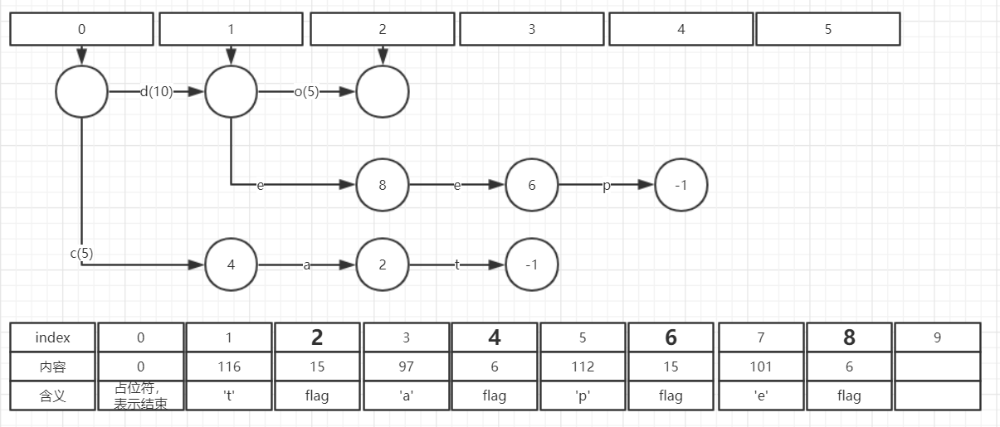
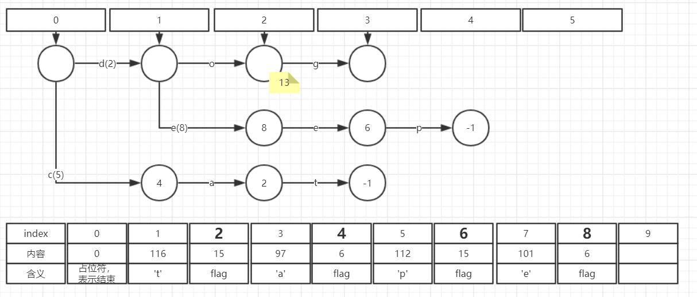
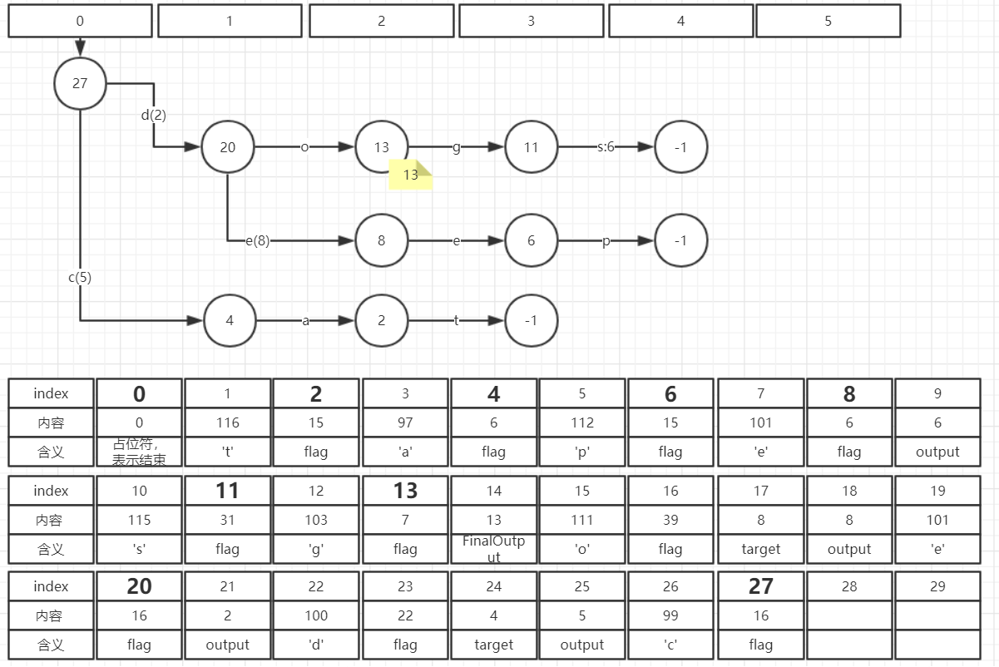

### 目录

### 1. FST简介
FST, 全称Finite State Transducer, 中文翻译: 有限状态转换器或有限状态传感器。
FST最重要的功能是可以实现Key到Value的映射，相当于HashMap<Key,Value>。FST的内存消耗要比HashMap少很多，
但FST的查询速度比HashMap要慢。

### 2. FST定义 
一个FST是一个6元组 (Q, I, O, S, E, f):  
- Q是一个有限的**状态**集
- I是一个有限的**输入符号**集
- O是一个有限的**输出符号**集
- S是Q中的一个状态，称为**初始状态**
- E是Q的一个子集，称为**终止状态**集 
- f是转换函数, f ⊆ Q × (I∪{ε}) × (O∪{ε}) × Q，其中ε表示空字符。
即从一个状态q1开始，接收一个输入字符i，可以到达另一个状态q2，并产生输出o。

例如有下面一组映射关系：  
cat -> 5  
deep -> 10   
do -> 15   
dog -> 2  
dogs -> 8    
可以用下图中的FST来表示：  
  
   
### 3. Lucene中的FST
Lucene中已经有FST的开源实现，在org.apache.lucene.util.fst包下，我使用的lucene版本为6.6.1。  
lucene中的FST有以下特性：  
- 构建最小FST的过程快速且内存消耗低(但是**输入必须有序**)
- 构建完毕之后，整个FST全部用byte[]表示，反序列化快速且 Object的内存额外消耗低
- 支持按Output查找,如果Output是有序的话
- 可插拔的Outputs表示法
- 可以顺序迭代每一对<输入, 输出>   

### 4. Lucene FST的构造API
Lucene使用Builder类来构造一个FST，一个示例如下:  
```
String inputValues[] = {"cat", "deep", "do", "dog", "dogs"};
long outputValues[] = {5, 10, 15, 2, 8};

PositiveIntOutputs outputs = PositiveIntOutputs.getSingleton();
Builder<Long> builder = new Builder<Long>(FST.INPUT_TYPE.BYTE1, outputs);
IntsRefBuilder scratchInts = new IntsRefBuilder();
for (int i = 0; i < inputValues.length; i++) {
    BytesRef scratchBytes = new BytesRef(inputValues[i]);
    builder.add(Util.toIntsRef(scratchBytes, scratchInts), outputValues[i]);
}
FST<Long> fst = builder.finish();
```
1. 构造一个Builder对象，Builder(INPUT_TYPE inputType, Outputs<T> outputs)。  
其中inputType指明每一个输入符号占几个字节，有BYTE1, BYTE2, BYTE4三个可选值  
outputs则是FST的输出的运算抽象 
2. 依次加入每一对<输入，输出>对(输入必须有序)。调用add(IntsRef input, T output)。  
这里将输入串看作一个int[]， 但实际每一个输入符号占几个字节还是由INPUT_TYPE决定。 
3. 调用builder.finish()，生成FST

### 5. Lucene FST的构造过程图示 
Lucene FST在构造完毕之后，所有数据都存储在一个byte[]之中(反向排列)，没有任何多余的对象。 
但是在构造过程中，需要Node（节点）和Arc（边）两类对象来辅助构造。  
Lucene FST中的Node分为两种：
- CompiledNode : 表示这样一类Node，他们已经被写入到bytes中，并确定了在bytes中的位置。 这类Node只需要存储其在bytes中的位置，占用内存少。
- UnCompiledNode :  还未写入到bytes中的Node，这类Node需要存储的信息比较多。

Builder类主要维护两部分数据：
- BytesStore bytes  ：可以看做是一个字节数组，最终用来存储FST的二进制表示。
- UnCompiledNode<T>[] frontier ： 用来辅助构造 

下面是FST构造过程中，frontier和bytes的变化过程。在下面的图中：
- frontier第一行的圆圈表示UnCompiledNode
- 后面各行的圆圈都表示CompiledNode
- 每一条边上，"c(5)"表示输入字符为'c'，输出为5； "a"表示输入字符为'a'，无输出(或者输出为0)
- 黄色标签表示节点的Final Output 
- bytes中一个粗体的位置表示一个Node的开始。

#### （1） 调用new Builder()   
此时frontier中为空  
初始化bytes，并写入一个0，表示FST的结束。   
#### （2） 插入cat -> 5  
   

#### （3） 插入deep -> 10   
Builder.add(IntsRef input, T output)方法主要有以下四个步骤：
- 计算当前字符串和上一个字符串的公共前缀
- 调用freezeTail方法, 从尾部一直到公共前缀的节点，将已经确定的状态节点冻结。
这里会将UncompiledNode序列化到bytes当中，并转换成CompiledNode。 
- 将当前字符串形成状态节点加入到frontier中
- 调整输出值。   
   

#### （4） 插入do -> 15  
  

#### （5） 插入dog -> 2   
do->15, dog->2    
此时无论怎么调整边的值，都无法满足要求(必须在正数范围内)。因此引入一个新的概念Final output ,即下图中的黄色注释部分。 
对于每一个终止状态，可以有一个Final output。从起始状态遍历到终止状态:  
output1 + output2 + ... + outputN + FinalOutput = 最终输出 
  

#### （6） 插入dogs -> 8 
  

#### （7） 调用Builder.finish
  

至此， FST已经全部构造完成。 frontier可以全部丢弃，只留下bytes即可。  
从bytes中可以看出的是，每条边都有一个字节表示flag,而且每条边都有一个输入字符。  
但是，还有一些问题：
- 为什么有的边有输出，有的边没有输出，如何区分？ 
- 为什么有的边有目标节点target，有的没有，没有target的节点如何确定其目标节点？
- 节点27有2条边，节点2有1条边，Node之间是如何划分区域的？ 
- 哪些节点是终态？哪些不是？ 
- ......  

这些信息全部存储在flag之中。每条边都有一个flag,占一个字节，总共8个bit。其中：
- 第一位为BIT_FINAL_ARC，表示此边的目标节点是否为终态(可接受状态)
- 第二位为BIT_LAST_ARC，表示此边是节点的最后一条边，此边后面的内容就是下一个节点了。一个节点的所有边按顺序写入到bytes中，只有最后一条边被标记为BIT_LAST_ARC
- 第三为为BIT_TARGET_NEXT，表示此边应用了target_next优化，bytes中的下一个Node就是此边的目标节点。 
- 第四位为BIT_STOP_NODE，表示此边的目标节点是-1
- 第五位为BIT_ARC_HAS_OUTPUT，表示此边有输出
- 第六位为BIT_ARC_HAS_FINAL_OUTPUT，表示此边的目标节点有输出(final output)
- 第7位为BIT_TARGET_DELTA，表示此边的目标节点以差值编码方式存储
- 第8位未使用

TODO: flag 举两个例子 

TODO: Lucene FST查询API

TODO： FST与HashMap的比较  
      	HashMap图示  
      	性能对比   
      	1. 网络截图  
       	2. 英文词典测速： 构造时间，内存占用， 查询速度。  
       	
TODO: FST在Lucene当中的应用   
 
### 参考资料
FST定义：https://en.wikipedia.org/wiki/Finite-state_transducer   
FST图示：http://examples.mikemccandless.com/fst.py  
http://blog.sina.com.cn/s/blog_4bec92980101hvdd.html
https://www.cnblogs.com/bonelee/p/6226185.html
https://blog.csdn.net/whinah/article/details/9980893