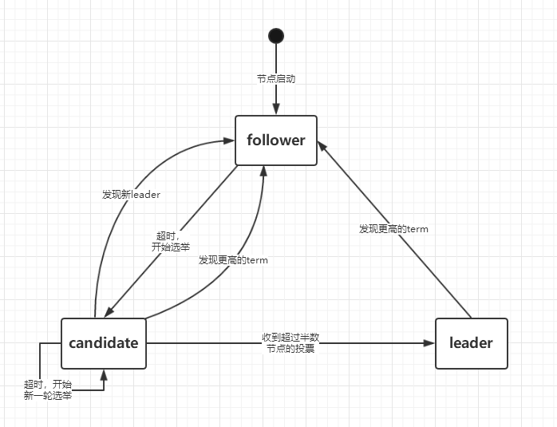

## 5. Raft一致性算法

#### Raft算法描述

##### 状态
所有节点上的持久化状态（在响应RPC之前更新到可靠存储上）：  
- currentTerm： 该节点见到的最新的任期（初始值为0，单调递增）
- votedFor：在当前任期获取选票的candidate Id （当前任期内，该节点投票给了谁？）
- log[]：日志条目。每个条目包含： 执行的命令  和 收到时的任期号

所有节点上的非持久化状态：  
- commitIndex：最大的已被commit的日志的index （TODO：commit表示已经复制到过半的节点上）
- lastApplied: 最大的已被应用到状态机上的日志的index （初始化是0，单调递增）（TODO: 这个为什么不要持久化？？）

leader节点上的非持久化状态（选举后重新初始化）： 
- nextIndex[]：对于每个节点，下一个要发送给该节点的日志的index(初始值为leader的最后一个日志index+1)
- matchIndex[]：对于每个节点，已经复制的日志的最大索引（初始化为0，单调递增）

##### AppendEntries RPC（由leader调用，用于向其他节点复制日志，也作为心跳）
参数： 
- term：leader节点的任期
- leaderId：leader节点的ID，让follower可以重定向客户端请求。
- prevLogIndex：此次追加的上一条日志的index （为什么是上一条？）
- prevLogTerm：此次追加的上一条日志的任期
- entries[]：此次追加的日志（空则为心跳请求）
- leaderCommit：leader的commitIndex

返回值： 
- term：currentTerm，使leader能够更新自己的任期（如果这个返回值比leader自身的大，那么leader就要降级成follower）
- success：如果follower节点能够匹配prevLogIndex和prevLogTerm，则返回true  

接收者follower上的实现：  
1. 如果term< currentTerm, 返回false  （详见5.1）
2. 如果在 log[prevLogIndex]位置上的日志条目的term不匹配prevLogTerm,返回false （详见5.3）
3. 如果当前已经存在的某个条目与新的条目有冲突（相同的index，不同的term），
则删除这个旧条目以及它后面的所有条目。 （详见5.3） 
4. 将还没有的条目全部追加到log[]中
5. 如果leaderCommit > commitIndex， 则设置 commitIndex = min(leaderCommit, 最后一个新条目的index)

##### RequestVote RPC（由candidates调用，用来收集选票）
参数：
- term： candidate的任期
- candidateId：candidate 的ID
- lastLogIndex： candidate上最后一条日志的index
- lastLogTerm： candidate上最后一条日志的term  

返回值：  
- term : currentTerm，让candidate能够更新自己的任期
- voteGranted : true表示给candidate投票

接收者上的实现：   
1. 如果term<currentTerm，返回false
2. 如果votedFor==null 或 votedFor==candidateId，并且candidate上的日志大于或等于接收者的日志，
则接收者投票给candidate，即返回true。

##### Rules for Servers（节点上的执行规则）
所有节点：
- 如果commitIndex>lastApplied，则递增lastApplied，并将log[lastApplied]应用到状态机
- 如果RPC请求或响应中包含的term > currentTerm，则设置curretnTerm=term，并将自身角色转换成follower 

Followers：
- 响应candidates和leaders的RPC请求
- 如果在选举超时时间内没有收到来自leader的AppendEntries RPC 并且没有给candidate投票，则将自身角色转换成candidate

Candidates：
- 一旦转换成candidate，则开始选举：
    - 递增currentTerm
    - 给自己投票
    - 重置选举倒计时器
    - 向其他所有节点发送RequestVote RPC
- 如果收到超过半数的节点的选票，则成为leader
- 如果收到新leader的AppendEntries RPC，则将自身转换成folloer 
- 如果选举时间超时，则开始新的一轮选举。  

Leaders：   
- 一旦当选成为leader，向其他所有节点发送一条空的AppendEntries RPC（心跳），并在以后的空闲时间重复发送心跳，
以防止其他节点的选举时间超时。
- 如果收到客户端的命令，将命令追加到本地的log[]中，在日志被应用到状态机后响应给客户端。 
- 对于每一个follower： 如果最后一条log的index >= nextIndex[follower]，则发送一条AppendEntries RPC，
其中包含了从nextIndex开始的所有日志
    - 如果成功： 更新相应的follower的nextIndex和matchIndex
    - 如果因为日志不一致而失败： 递减nextIndex然后重试
    - 如果存在一个N满足N>commitIndex, 使得超过半数的matchIndex[i]>=N, 并且log[N].term==currentTerm，
    则设置commitIndex=N（如果一条日志已经被复制到过半的节点上，则认为是已提交的，可以被安全的应用到状态机中） 

#### Raft算法的关键特性
1. Election Safety： 在一个任期内，最多只会选举出1个leader （详见5.2） 
2. Leader Append-Only： 在leader上，从来都不会覆盖或删除任何一条日志，只会追加新的日志条目
3. Log Matching： 如果两个节点的log[]中，包含一个日志条目有相同的index和term，
则这两个节点的日志 log1[1~index] 和 log2[1~index]都是相同的。 
4. Leader Completeness： 如果一个日志条目在某个给定的任期内被commit，那么这个日志条目将会出现在所有更高任期的leader上。 
5. State Machine Safety：如果一个节点已经将在index位置的日志应用到状态机，那么就不会有其他的节点在相同的位置应用一条不同的日志。

### 5.1 Raft 基础 
一个Raft集群包含多个节点。在任一时刻，每个节点都处于以下3种状态之一： 
- follower：follower是被动的，他们不会发出任何的请求，只会处理并响应来自leader和candidate的请求。 
- leader：leader处理所有来自客户端的请求（如果客户端请求到了follower，follower会将其重定向到leader）
- candidate：用来选举出一个新的leader 

  
正常情况下，只有1个leader，其他的都是follower, 上图展示了所有的状态及其转换关系，下面会详细讨论每一种转换关系。

Raft把时间分隔成任意长度的任期（term），如下图所示。任期用连续的整数标记。每一段任期都从一次选举开始，
在这次任期中，一个或多个candidate尝试称为leader。如果一个candidate赢得选举，他就会在这个任期的剩余时间里充当
leader。在某些情况下选举会导致分裂投票，无法选出leader，那么这一任期会以没有leader结束，然后开始下一个任期。
Raft保证了在任一任期内，最多只会有1个leader

不同的节点可能在不同的时刻观察到任期的转换，在某些情况下一个节点可能都没有观察到一次选举甚至没有观察到整个任期。
任期在Raft中充当了逻辑时钟的用途，它让节点能够检测过期的信息，比如过时的leader。每一个节点存储一个currentTerm表示当前任期号，
该编号随着时间单调递增。节点之间通信时会交换当前任期号；如果一个服务器的当前任期号比其他的小，该服务器会将自己的任期号更新为较大的那个值。
如果一个candidate或者leader发现自己的任期号过期了，它会立即回到follower的状态。如果一个节点接收到一个包含过期的任期号的请求，它会直接拒绝这个请求。

Raft使用RPC来进行节点之间的通信，并且基础的一致性算法只需要两种类型的RPC。RequestVote RPC由candidate在选举期间发起，
AppendEntries RPC由leader发起，用来复制日志并提供一种心跳机制。第7节为了在服务器之间传输快照增加了第3种RPC。
当服务器没有及时的收到RPC的响应时，会进行重试，并且他们会并行的发起RPC来获得最佳的性能。 

### 5.2 Leader选举
Raft使用一种心跳机制来触发选举。节点启动时，都处在follower状态。一个 

